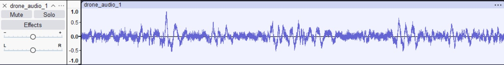
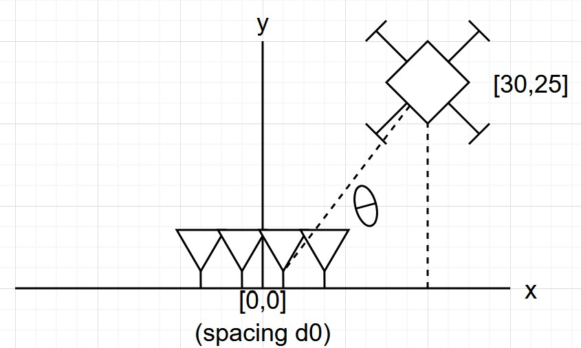
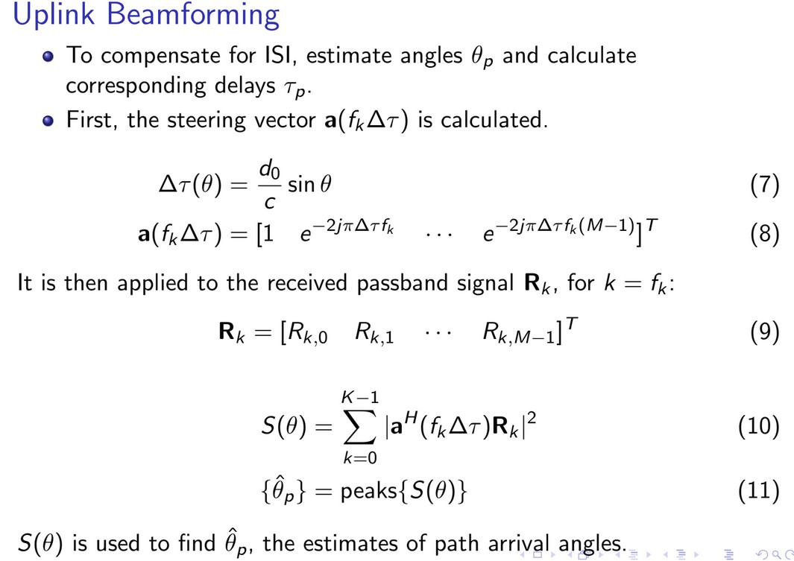
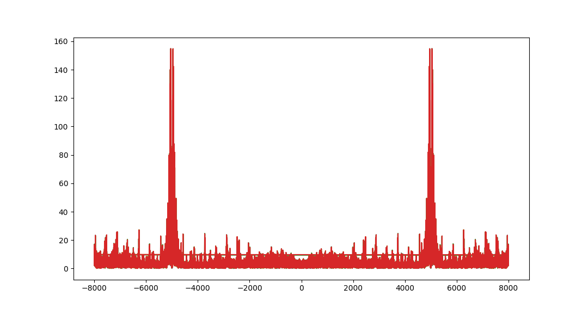
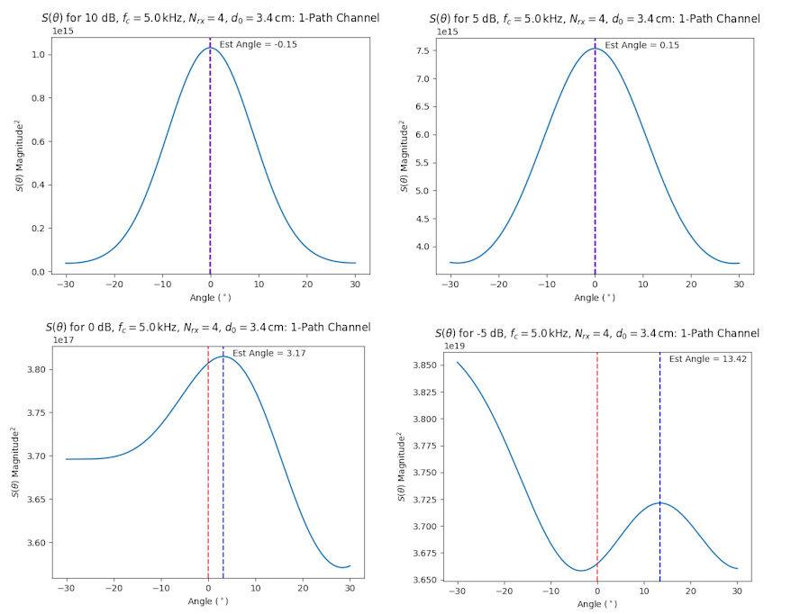

A simple demonstration of acoustic beamforming techniques for detection Unmanned Aerial Systems (UAS). Code available [here](https://github.com/N2WU/python-acoustic-cuas).

I've heard various accounts that acoustic signatures - sounds, as opposed to radio waves or radar techniques - are highly effective at tracking drones. Because drones operate often at widely availble Wi-Fi and Bluetooth frequencies, the overwhelming presence of devices and frequency-hop nature of the waveform standards in these RF bands can saturate a detector's ability to direction find and track these devices.

Similarly, radar emits a signature of its own, making counter-uas (cUAS)... _problematic_ in a real-word scenario. 

Drones emit, of course, a distinct sound when they fly. This article attempts to use that acoustic signature as means to estimate the angle of arrival using a conventional delay-and-sum beamformer.

# Background - Acoustic DSP

Acoustic beamforming is widely similar to traditional RF beamforming techniques. However, acoustic waves are pressure waves affected by more multipath, doppler, and scattering impairements than line-of-sight waves with a shorter propagation distance.

Most of this exploratory cUAS research was constructed off of many projects in acoustic wireless _communication_. Just like radios may use a QPSK signal to communicate across channels with scattering and multipath, acoustic devices can employ a QPSK signal in audible range (sometimes a carrier frequency of 5kHz and a bit rate of 1 bit per second) to communicate across open air or water. A fun demonstration of OFDM to transmit an image across open-air (like using the microphone and speakers of your computer simultaneously) can be found [here](https://github.com/N2WU/audio_ofdm). My master's thesis's python code in this topic (single-carrier acoustic beamforming) can be found [here](https://github.com/N2WU/sc-adaptive-beamforming/tree/main/final_code) - it probably needs a whole post (read, website) of its own.

A comprehensive review of acoustic channel characterization can be found [here](https://www.mit.edu/~millitsa/resources/pdfs/nafplio.pdf).

Acoustic digital modulation is explained nicely in a blog post [here](./2025-06-12-acoustic-toolbox-part-1.md). Essentially, a baseband signal undergoes pulse shaping and filtering at its audio sampling frequency (typical rates like 8kHz, 16kHz, 48kHz common on CDs) for a carrier frequency of 5kHz. 

In this simulation, I treated commonly available drone signals as a digital communications signal at baseband. I pulled my signal from [this online repo](https://github.com/saraalemadi/DroneAudioDataset/tree/master/Binary_Drone_Audio/yes_drone) and normalized the audio between -1 and 1.

The drone signal in audacity is shown below. It looks like a typical periodic signal:



# Intro to Beamforming

[Beamforming](https://pysdr.org/content/doa.html) is a method of calculating weights for an electronically steered array to identify angles for direction finding. It can be used as a transmitter, to "point" a signal in a known direction, or as a receiver, to estimate angles of arrival. 

There are many different techniques for beamforming. Most commonly, an antenna array consists of several linearly-spaced omnidirectional antennas designed for an optimal carrier frequency $f_c$ with a distance between elements $d_0$. This distance is also a factor of wavelength using the equation $d_\lambda = \frac{f_c d_0}{c}$ where $c$ is the wavespeed in a propagation medium - for air and EM waves, this is the speed of light; for acoustic signals in open air, this is 340 m/s.

I set up my simulation using a delay-and-sum geometric approach. I make a coordinate plane with my antenna array (number of receiver antennas n_rx) centered at the origin; then, I place my signal at a coordinate point away from the receiver.

This only matters to determine direction. I am varying the SNR of the test manually, so I am not subjecting my incident sound wave to propagation path loss. 20 dB from the UAS is 20 dB at the receiver, whether it is 1 meter or 100 meters away. My coordinate plane looks like the following for the simulation:


_(not to scale)_

Note this is only 2-D, similar to an overhead view. a 3D view is certainly possible, but not in this current simulation.

Angle estimation is an estimation tool. I am using a method implementing the [Power Spectral Density](https://ocw.mit.edu/courses/6-011-introduction-to-communication-control-and-signal-processing-spring-2010/8075041184d566103ce7c3f69afc5e75_MIT6_011S10_chap10.pdf) (PSD, or _S_) to give a best guess where my transmitter is. More information in the acoustic approach for PSD estimation (also called the _S of theta method_ can be found [here](https://www.isca-archive.org/interspeech_2025/tao25b_interspeech.pdf), mostly equations 15 and 23).

In a slide format:



The benefit of this method is that we do not need to know much about the signal to still estimate its angle. A mostly unknown drone signal may have a "carrier" frequency at anywhere within the range of human hearing - this approach just identifies where the most power will be coming from. Unfortunately, it can easily be overwhelmed with jammers as the approach does not discern between nonwhite noise and the true transmitter.

After the power graph is generated, angle estimation is easily calculated by choosing the largest continuous peaks on the $S(\theta)$ function.

# Code, Delay-And-Sum Approach

The code for this simulation is available [here](https://github.com/N2WU/python-acoustic-cuas). To begin, I first loaded a .wav file with a known drone signal and normalized the audio to be within -1 and 1. Using scipy, the read function also gave me a sampling frequency for the read audio. This sampling frequency determined the sampling frequency of my detector.

Performing the FFT of the signal reveals peaks near 2kHz, meaning a sampling frequency of ~5kHz will be able to detect this signal.



After I define constants for the simulation, I calculate the angle and distance between each receiver element and the transmitter location. This translates to a delay in samples for each signal. The delays are applied in my received signal r_multi using the following loop:

```python
delay = np.round(delta_tau * Fs).astype(int) # now delay in samples (1 by nrx)

for j, delay_j in enumerate(delay): 
    r_multi[delay_j:delay_j+len(s), j] += s # combine the incident delays (ns by nrx)
```

I find the angle and apply beamformer weights for each receiver $w_k(\theta)$. For each SNR, I do the following:

1. Perform geometric simulation (as shown above)
2. Find the $S(\theta)$ function
3. Estimate the angle $\hat(\theta)$ for the function

# Results

In general, the $S(\theta)$ method works to estimate the UAS signal. In varying from -5 to 10 dB, it is clear that as dB increases, the error between estimated and true angle decreases.

Here's a plot for the PSD as a function of estimated angle over multiple SNRs for a drone at 0 degrees:



# Conclusion

This is a very rough outline for further improvements. Mainly I will add:

1. Multipath channels, to introduce more scattering and delay
2. 3D estimation
3. Doppler estimation for faster moving targets
4. More support for other beamforming methods, in case one is better than the current method
5. Analysis for other drone signals - there are thousands available in the dataset.

I've linked the code above. I encourage you to download and play with the code - see what happens when you vary the sampling rate, element spacing, drone signal, SNR, or introduce a different analysis tool.
